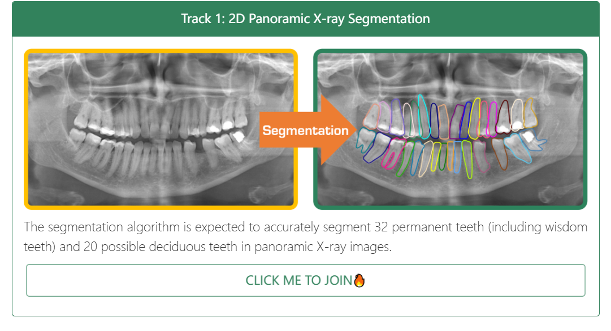

# 🦷 STSR 2025: 3rd Semi-supervised Teeth Segmentation and Registration MICCAI Challenge  
**MICCAI 2025, Daejeon, Republic of Korea | September 23-27, 2025**  

[Challenge Main Website](https://songhen15.github.io/STSdevelop.github.io/miccai2025/index.html)

---

## 📖 Table of Contents
- [Introduction](#-introduction)
- [Tracks](#-tracks)
- [Important Dates](#-important-dates-pst)
- [Contact](#-contact)

---

## 📌 Introduction  
Computer-aided diagnosis tools are increasingly popular in modern dental practice, particularly for treatment planning or comprehensive prognosis evaluation. With the advancement of oral digitalization and three-dimensional scanning technology, cone-beam computed tomography (CBCT) and intraoral scanning (IOS) have been widely applied in clinical dental treatment. Intraoral scanning (IOS) models offer high resolution, relying solely on IOS data for treatment carries the risk of insufficient root information. Conversely, CBCT provides comprehensive information on both crowns and roots, but its scanning resolution is lower, and it contains more redundant information. Therefore, combining the two can better utilize their complementary strengths, enhancing the precision and efficiency of dental treatment. Furthermore, automated and precise evaluation of root pulp canals in CBCT images holds significant importance, as it can substantially enhance the precision and efficiency of root pulp canals treatment. Precise segmentation of the root pulp canal allows for a clearer visualization of its morphology, branches, and curvatures, facilitating the development of more refined filling strategies. However, the annotation of tooth root pulp canal regions in CBCT images is inherently labor-intensive, requiring a substantial investment of time and human resources.

In this year, building upon the previous semi-supervised challenge theme, we host two novel subtasks, which are semi-supervised CBCT-IOS registration and CBCT teeth and root pulp segmentation. We are proud to announce the launch of the challenge workshop. If you are interested in publishing a workshop paper, please 👉read the CfP and submit your paper.

---

## 🏁 Tracks  

### Track 1: CBCT teeth and root pulp canal segmentation

The segmentation algorithm is expected to segment all the teeth and root pulp canal accurately.

[CLICK ME TO JOIN🔥](#)

### Track 2: CBCT-IOS registration

The registration algorithm is expected to register the teeth crown and the corresponding root.

[CLICK ME TO JOIN🔥](#)

---

## 📬 News
We are excited to share some recent news and updates with you, highlighting significant milestones and upcoming events that reflect our ongoing efforts and achievements in the STSR 2025 Challenge:

[2025.04] The competition is officially launched and baseline is available!!!
[2025.03] Our challenge has been accepted by the MICCAI 2025, as a part of ONDI Workshop!!!

## 🗓️ Important Dates (PST)

| Event                                | Date         |
| ------------------------------------ | ------------ |
| Registration Open                    | April 25     |
| Challenge Validation Deadline        | August 15    |
| Challenge Final Deadline             | August 22    |
| Announcement of Challenge Winners    | August 31    |
| Conference Date                      | September 23-27 |

---

## 📧 Contact
For any inquiries, please feel free to reach out via email at SemiTeethSegChallenge@outlook.com or zhi.li@hdu.edu.cn. We welcome any questions, feedback, or requests for further information regarding the STSR 2025 Challenge. If you have urgent or additional needs, We look forward to meeting each one of you this year, face to face if possible. See you at Daejeon, Republic of Korea!

Copyright @ College of Media Engineering, Communication University of Zhejiang, Hangzhou, 310018, China.